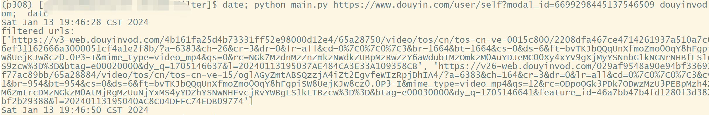
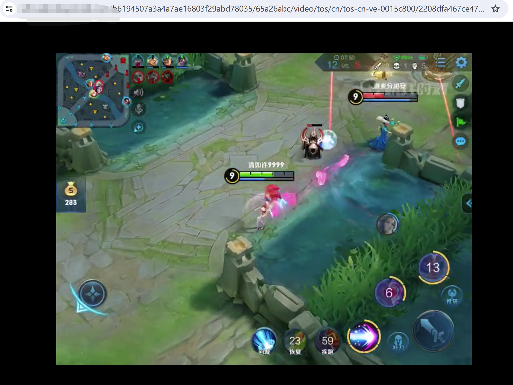

# Project Name
chrome_filter, a small tool for extracting video source file URLs from video web.

## Introduction
When browsing short video websites, we often encounter short videos we like and have the desire to download them to our local computer or cell phone, but the user interface does not provide a download function.

This small tool provides a convenient feature to automatically extract the original short video source URL from the short video webpage URL. Users need to attach two parameters when running Python scripts. The first parameter is the short video webpage URL link. The second parameter is the feature string of the video source URL, for example: douyinvod.com. If the URL link of the video source is successfully extracted, output the URL link to the console. Users need to download the original video manually.
The downloaded original video may not contain information such as watermarks and original authors. Users should respect the copyright of the original author and do not use it for commercial purposes.

The mini tool supports different short video platforms as well as other non short video websites. When running the script, it is necessary to replace the feature string with the corresponding platform's feature string.

If the short video platform updates the link mode of the original video, such as updating the CDN domain name that affects the feature string, then the feature string needs to be updated synchronously. When running the browser, enable debugging mode to query the full link of original video.

## Deployment Environment
In this section, we will explain the deployment environment requirements of the project and provide corresponding installation guidelines.

### Hardware requirements
- Personal computer or server
- Memory: At least 1GB
- Storage space: At least 1GB of free space

### Software requirements
- Operating system: Windows, Linux, or macOS
- Python 3.8 or higher

### Installation steps
1. Download the project source code
2. Install Python
3. Install dependency packages
4. Install third-party libraries
5. Run the project

## Obtain source code
In this section, we will provide a method to obtain the project source code.

    1. Clone Github repository:
       ```
       git clone https://github.com/solomonxu/chrome_filter.git
       ```

    2. Alternatively, download the ZIP file:
    - Open the github page of the project: [Project link]（ https://github.com/solomonxu/chrome_filter.git ）
    - Click the "Download" button and select "Download ZIP"

## Installing Python
Taking the Ubuntu operating system as an example:
   ```
   sudo apt update
   sudo apt install python3
   sudo apt install pip
   ```

## Installing third-party libraries: browsermob proxy
Taking the Ubuntu operating system as an example:

    1. Install JDK:
        ```
        Sudo apt install openjdk-8-jdk
        ```

    2. Install browsermob-proxy:
        ```
        sudo wget --no-check-certificate https://github.com/lightbody/browsermob-proxy/releases/sudodownload/browsermob-proxy-2.1.4/browsermob-proxy-2.1.4-bin.zip
        sudo unzip browsermob-proxy-2.1.4-bin.zip
        sudo mv browsermob-proxy-2.1.4 /usr/local/browsermob-proxy
        ```

    3. Add browsermob-proxy to the environment variable. Execute the following command:
      ```
      cd /usr/local/browsermob-proxy/bin
      sudo chmod ao+x browsermob-proxy
      echo "export PATH=\$PATH:$(pwd)" >> ~/.bashrc
      source ~/.bashrc
      ```

## Installing third-party libraries: Chrome
Taking the Ubuntu operating system as an example:

    1. Add software sources for Chrome. Run the following command to download and install Google's software source key:
      ``` 
      wget -q -O - https://dl.google.com/linux/linux_signing_key.pub | sudo apt-key add -
      ``` 
      sudo sh -c 'echo "deb [arch=amd64] http://dl.google.com/linux/chrome/deb/ stable main" >> /etc/apt/sources.list.d/google-chrome.list'
      ```

    2. Update the list of software packages. Run the following command to update the package list for Ubuntu:
      ```
      sudo apt update
      ```

    3. Install Chrome browser. Run the following command to install Chrome:
      ```
      sudo apt install google-chrome-stable
      ``` 

## Running
In this section, we will provide the steps to run the project.

    1. Enter the project directory:
      ```
      cd chrome_filter
      ```

    2. Install dependency packages:
      ```
      sudo pip install -r requirements.txt
      ```

    3. Running the project:
      ```
      python3 main.py <page_url> <pattern>
      ```

    Replace the <page_url> and <pattern> with the short video page URL and pattern string, respectively. For example:
      ```
      python3 main.py https://www.douyin.com/user/self?modal_id=6699298445137546509 douyinvod.com
      ```
   

## Effect
In this section, we will demonstrate the operational effectiveness of the project and provide corresponding screenshots.

    The following is an example screenshot of the project:

    1. Short video web interface:

   

    2. After extracting to the original video (without watermark):

   
