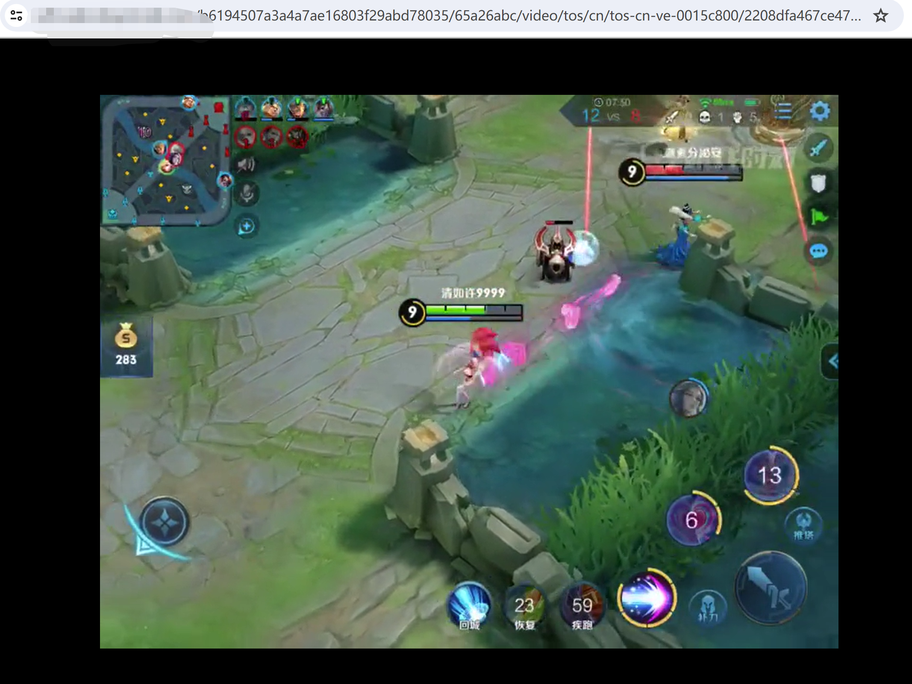

# 项目名称
一个从视频网页提取视频源文件网址的小工具chrome_filter。

## 引言
我们浏览短视频网站时，经常遇到喜欢的短视频，此时有下载到本地电脑或者手机的愿望，但是用户界面没有提供下载功能。
这个小工具提供了简便的功能，从短视频网页URL自动提取原始短视频源URL。用户运行Python脚本，要附带两个参数。第一个参数是短视频网页URL链接。第二参数是视频源URL的特征串，例如：douyinvod.com。如果成功提取视频源的URL链接，则输出URL链接到控制台。用户需要自行下载原始视频到本地。
下载的原始视频可能不包含水印和原创作者等版本信息。用户应该尊重原作者的版权，不能用于商业用途。

小工具支持不同的短视频平台，也支持其他非短视频网站。运行脚本时，需要把特征串替换成相应平台的特征串。
如果短视频平台更新了原始视频的链接模式，例如更新了CDN域名影响到特征串，则需要同步更新特征串。在运行浏览器时启用调试模式，可以查询到完整的原始视频链接。

## 部署环境
在这个部分，我们将说明项目的部署环境要求，并提供相应的安装指南。

### 硬件要求
- 个人电脑或服务器
- 内存：至少 1GB
- 存储空间：空闲空间至少 1GB

### 软件要求
- 操作系统：Windows、Linux 或 macOS
- Python 3.8 或更高版本

### 安装步骤
1. 安装 Python
2. 安装第三方库
3. 下载项目源码
4. 安装依赖包
5. 运行项目

## 安装 Python
以 Ubuntu 操作系统为例：
```
sudo apt update
sudo apt install python3
sudo apt install pip
```

## 安装第三方库：browsermob-proxy
以Ubuntu操作系统为例：

1. 安装 JDK ：
   ```
   sudo apt-get install openjdk-8-jdk
   ```      

2. 安装 browsermob-proxy：
   ```
   sudo wget --no-check-certificate https://github.com/lightbody/browsermob-proxy/releases/download/browsermob-proxy-2.1.4/browsermob-proxy-2.1.4-bin.zip
   sudo unzip browsermob-proxy-2.1.4-bin.zip
   sudo mv browsermob-proxy-2.1.4 /usr/local/browsermob-proxy
   ```

3. 将 browsermob-proxy 添加到环境变量。执行以下命令：
   ```
   cd /usr/local/browsermob-proxy/bin
   sudo chmod ao+x browsermob-proxy
   echo "export PATH=\$PATH:$(pwd)" >> ~/.bashrc
   source ~/.bashrc
   ```

## 安装第三方库：Chrome
以 Ubuntu 操作系统为例：

1. 添加 Chrome 的软件源。运行以下命令以下载并安装 Google 的软件源密钥：：
   ``` 
   wget -q -O - https://dl.google.com/linux/linux_signing_key.pub | sudo apt-key add -
   ``` 
   然后运行以下命令以添加 Chrome 的软件源：
   ``` 
   sudo sh -c 'echo "deb [arch=amd64] http://dl.google.com/linux/chrome/deb/ stable main" >> /etc/apt/sources.list.d/google-chrome.list'
   ``` 

2. 更新软件包列表。运行以下命令以更新 Ubuntu 的软件包列表：
   ```
   sudo apt update
   ```

3. 安装 Chrome 浏览器。运行以下命令以安装 Chrome：
   ```
   sudo apt install google-chrome-stable
   ``` 

## 获取源码
   在这个部分，我们将提供获取项目源码的方法。

1. 克隆 Gitee 仓库：
   ```
   git clone https://gitee.com/solomonxu/chrome_filter.git
   ```

2. 或者下载 ZIP 文件：
   - 打开项目的 Gitee 页面：[项目链接](https://gitee.com/solomonxu/chrome_filter.git)
   - 点击 "Download" 按钮，选择 "Download ZIP"

## 运行
在这个部分，我们将提供运行项目的步骤。

1. 进入项目目录：
   ```
   cd chrome_filter
   ```

2. 安装依赖包：
   ```
   sudo pip install -r requirements.txt
   ```

3. 运行项目：
   ```
   python3 main.py <page_url> <pattern>
   ```
   把page_url和pattern分别替换成短视频页面URL和模式字符串。例如：
   ```
   python3 main.py https://www.douyin.com/user/self?modal_id=6699298445137546509 douyinvod.com
   ```
   

## 效果
在这个部分，我们将展示项目的运行效果，并提供相应的截图。

以下是项目的示例截图：
1. 短视频网页界面：

   

2. 提取到原始视频后（不含水印）：

   
